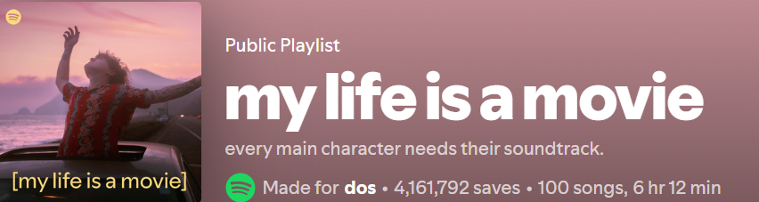
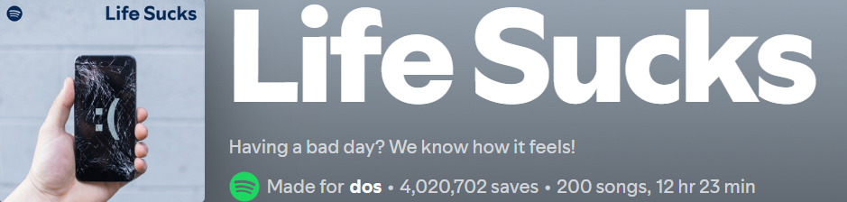
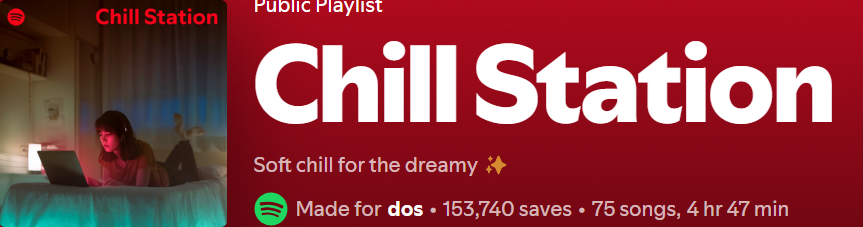
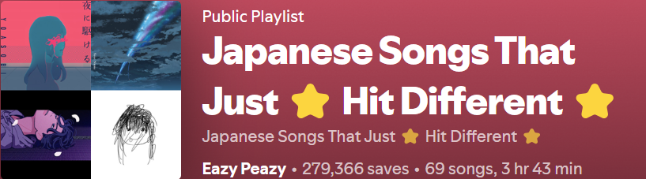

===

Hi 👋, I am <strong><a href="https://github.com/lemondiee" style="color:white;::after:white">Dos</a></strong> an enthusiastic and ambitious learner, not yet Graduated. But I want to soon join the guild and be one of them who brings the change✨  

**Languages I love coding in**: 

**OS I use**

**Databases**

**Frameworks**

**My Editors/IDEs**

**Extras**:

   

  

 

 

)

 MY FAV PLAYLISTS 

***

